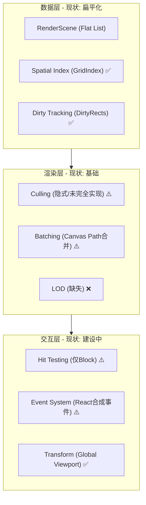

## 11/18 Review

> **当前目标**
> 短期目标是完善 `renderer-canvas` 的能力，使其从一个“玩具级”渲染器进化为**专业级**图形引擎。具体关注点在于：
> *   **连线系统 (Connectors)**：正交路由 (Orthogonal Routing)、箭头绘制、标签布局。
> *   **交互增强**：实现连线的命中检测 (Hit Test)、视口剔除 (Culling)。
> *   **性能**：保持高性能的渲染循环（脏矩形、分层渲染）。

### 项目进展 Review

根据目前 `packages/core` 和 `packages/renderer-canvas` 的进展，总结如下：

#### 已完成 (Solid Foundation)
*   **Core 架构**：
    *   `EditorState`, `Transaction`, `Step` 体系已完全建立。
    *   `History` (Undo/Redo) 逻辑已跑通。
    *   `Schema` 定义了 Block, Connector, Timeline 等基础数据结构。
*   **Renderer 基础**：
    *   **分层渲染**：实现了 Main (实体), Background (网格), Overlay (选区) 三层 Canvas 架构。
    *   **脏矩形机制**：`dirtyRects` 和 `renderDirtyRegion` 已实现，具备局部重绘能力。
    *   **空间索引**：引入了 `GridIndex` 用于加速查询。
    *   **Block 交互**：实现了 Block 的绘制、拖拽预览（`dragPreview` 机制设计得很棒，避免了拖拽时高频触发 Core State 更新）、命中检测。

#### 进行中 / 待实现 (Work in Progress / Missing)
以下关键模块尚未在代码中发现，或仅有打桩 (Stub)：

1.  **连线算法缺失**：
    *   `packages/renderer-canvas/src/geometry/` 下缺少 `orthogonal.ts`（正交路由算法）。
    *   缺少 `arrow.ts`（箭头几何计算）。
    *   缺少 `label.ts`（连线标签布局）。
    *   目前 `renderConnectors` 只是简单地画线，没有复杂的路径计算。

2.  **连线交互缺失**：
    *   `hitTest.ts` 中只有 `hitTestBlock`，缺少 `hitTestPolyline`（点到折线距离算法）。
    *   `WhiteboardRenderer.ts` 中的 `hitTestConnectorAt` 方法目前直接返回 `null` (MVP Stub)。

3.  **视口交互不完整**：
    *   虽然 Renderer 支持 `viewport` (pan/zoom)，但在 `Whiteboard.tsx` 组件中，我只看到了 `handleMouseDown` 处理 Block 选择和拖拽，**尚未看到处理画布平移 (Panning) 和缩放 (Zooming) 的事件监听逻辑**。

### 下一步

1.  **实现几何算法库**：在 `renderer-canvas/src/geometry` 中补充 `hitTestPolyline` (用于连线选中) 和 `arrow.ts` (用于箭头绘制)。
2.  **实现正交路由**：创建 `orthogonal.ts`，让连线不再是简单的直线，而是智能避障的折线。
3.  **完善交互**：在 `Whiteboard.tsx` 中补全画布的平移与缩放交互，并在 Renderer 中实现连线的命中检测。


## 调研 “坐标” 概念

这个话题是所有图形开发（游戏、CAD、可视化、地图）的基石。理解透彻了坐标系，你就能在图形世界里“随心所欲”。

### 1. 概念引入：为何要有这么多坐标系？

#### 为什么要有？
如果你只有一个坐标系（屏幕像素），世界会变得极其复杂且不可维护：
*   **移动画布**：你需要修改场景中 10000 个物体的 (x, y)。
*   **父子层级**：如果“手臂”连在“身体”上，身体移动时，你要手动算手臂的新位置。
*   **跨设备适配**：在 4K 屏和手机屏上，像素位置完全不同，逻辑代码无法复用。

#### 为何如此设计？
为了**解耦**。
*   **对象本身**只关心自己相对于父级的位置（局部坐标）。
*   **摄像机**只关心自己看哪里（视图变换）。
*   **屏幕**只关心最后的成像（屏幕坐标）。
每个层级各司其职，通过**矩阵变换 (Matrix Transform)** 串联起来。


### 2. 具体内容：三大核心坐标系

我们通常面临三个层次的坐标空间：

#### A. 屏幕坐标系 (Screen / Viewport Coordinates)
*   **是什么**：浏览器中的 `clientX / clientY`，单位是 **物理像素 (px)**。
*   **原点**：通常是 Canvas DOM 元素的左上角 (0, 0)。
*   **方向**：X 轴向右，Y 轴向下。
*   **用途**：处理鼠标/触摸事件的原始输入。

#### B. 世界坐标系 (World Coordinates)
*   **是什么**：你的虚拟画布的“绝对真理”。
*   **原点**：虚拟世界的中心 (0, 0)。这个点可能被用户拖到了屏幕外，或者缩放得很小。
*   **单位**：逻辑单位（可以是米、英里，或者自定义的 unit）。
*   **用途**：存储数据模型 (`block.x`, `block.y`)，进行物理碰撞检测、布局计算。

#### C. 局部坐标系 (Local / Model Coordinates)
*   **是什么**：物体内部的坐标。
*   **原点**：物体的锚点（通常是左上角或中心点）。
*   **场景**：如果 Block A 里面有一个子元素 Button B，B 的坐标 `(10, 10)` 是相对于 A 的左上角的，而不是相对于世界的。
*   **用途**：构建复杂的组合体 (Group / Component)。

### 3. 核心原理：变换链 (The Transform Chain)

一个点从“物体内部”显示到“屏幕”上，经历了一次次的**空间变换**。

$$ P_{screen} = Matrix_{camera} \times Matrix_{world} \times Matrix_{local} \times P_{local} $$

但在 2D 画布（如 Triplanner）中，通常简化为两步：

1.  **Local → World (Model Matrix)**
    *   如果 Block A 在世界 `(100, 100)`，Block 内的点 `(10, 10)`，在世界中就是 `(110, 110)`。
    *   公式：`P_world = P_local + Block_position` (仅平移)

2.  **World → Screen (Viewport Transform)**
    *   这是画布漫游（Pan/Zoom）的核心。
    *   假设视口缩放 `zoom=2`，视口中心偏移 `offset=(50, 50)`。
    *   公式：`P_screen = (P_world - Viewport_center) * zoom + Canvas_center`


### 4. 工程实践：Triplanner 中的应用

你现在的 `renderer-canvas/src/geometry/transform.ts` 实际上就是在处理这个。

#### 场景 1：渲染 (World → Screen)
当你在 `renderBlocks` 时，你拿到的 `block.x` 是**世界坐标**。你需要把它画在 Canvas 的正确像素位置。
```typescript
// renderer-canvas 代码逻辑
const screenPos = worldToScreen({ x: block.x, y: block.y }, viewport, canvasSize);
ctx.fillRect(screenPos.x, screenPos.y, ...);
```
*   **第一性原理**：渲染器是观察世界的窗口。世界不动，是窗口（视口）的参数在变。

#### 场景 2：交互 (Screen → World)
当用户点击鼠标时，拿到的是 `e.clientX` (**屏幕坐标**)。你需要知道他点中了世界里的哪个方块。
```typescript
// Whiteboard.tsx 代码逻辑
const worldPoint = renderer.screenToWorld({ x: e.clientX, y: e.clientY });
if (block.contains(worldPoint)) { select(block); }
```
*   **第一性原理**：命中检测必须在同一个空间下进行。通常把鼠标逆向投影到世界空间去对比，比把所有物体投影到屏幕空间对比要快（因为物体不用动）。


### 5. 面试问题：大厂高级-专家级

#### Q1 (高级): 如何实现画布的“以鼠标为中心缩放 (Zoom at Point)”？
*   **解析**：这是所有图形编辑器的标配体验。
*   **核心逻辑**：
    1.  记录缩放**前**鼠标在世界坐标的位置：`P_world_before`。
    2.  应用新的缩放比例 `zoom_new`。
    3.  反推视口偏移 (Translate)，使得缩放**后**鼠标指向的世界坐标 `P_world_after` 依然等于 `P_world_before`。
    4.  **不动点原理**：变换前后，鼠标指针下的那个“地理位置”不能变。

#### Q2 (资深): 如果有深层嵌套的 Group（组），如何高效进行点击检测？
*   **解析**：
    *   **朴素做法**：递归把子节点坐标算成世界坐标，再对比。慢。
    *   **逆变换做法 (Inverse Transform)**：
        1.  鼠标点 $P_{world}$。
        2.  进入 Group A：$P_{localA} = Matrix_A^{-1} \times P_{world}$。判断点是否在 A 的包围盒内。
        3.  如果是在 A 内，进入 Child B：$P_{localB} = Matrix_B^{-1} \times P_{localA}$。
    *   **优势**：只需变换这一个“点”，而不是变换场景里成千上万的三角形/矩形。

#### Q3 (专家): 为什么图形引擎（Pixi/Three）都用矩阵（Matrix）来描述变换，而不是存 x, y, scale, rotation？
*   **解析**：
    *   **统一性**：平移、旋转、缩放、切变，全都可以统一成一个 $3\times3$ (2D) 或 $4\times4$ (3D) 矩阵。
    *   **可组合性 (Composability)**：父节点的变换叠加给子节点，只需要做矩阵乘法：$Mat_{final} = Mat_{parent} \times Mat_{child}$。计算机做乘法非常快。
    *   **硬件加速**：GPU 天生就是做矩阵运算的。


### 6. 泛化学习：相对论与参考系

跳出前端，这其实是物理学中**“参考系 (Frame of Reference)”**的思想。
*   **相对性**：没有绝对的位置，只有相对于某个原点的位置。
*   **软件设计中的 Scope**：
    *   变量的作用域 (Scope) 就是一种“局部坐标系”。
    *   Docker 容器 / 虚拟机 就是操作系统层面的“局部空间”。
    *   理解了坐标转换，你就理解了如何在隔离的环境（容器/组件）和全局环境（宿主/应用）之间映射数据。


### 7. Cheat Sheet (复述/背诵版)

*   **三大坐标系**：
    *   **Screen (屏幕)**：px，交互入口，原点左上角。
    *   **World (世界)**：逻辑单位，数据存储，原点虚拟中心。
    *   **Local (局部)**：相对父级，组件化封装，原点自身锚点。
*   **两个变换**：
    *   **Model Transform**: Local → World (组装物体)。
    *   **Viewport/View Transform**: World → Screen (观察世界)。
*   **两个方向**：
    *   **渲染 (Render)**：正向 (World → Screen)。
    *   **交互 (HitTest)**：逆向 (Screen → World)。
*   **一个核心工具**：**矩阵 (Matrix)**。它是描述空间变换的通用语言。
*   **Zoom at Point 公式**：`(MouseWorld - ViewCenter) * zoom + CanvasCenter = MouseScreen`。保持鼠标下的世界点不变。


## 调研 “连线” 概念

这是一个非常棒的切入点。在图形编辑器（Canvas/SVG）领域，“连线（Edge/Connector）”的复杂度往往高于“节点（Node/Block）”。节点通常只是一个矩形，而连线涉及到**路径规划、几何计算、交互判定**以及**高性能渲染**的综合挑战。

基于你的 MH (Marijn Haverbeke) 架构背景，我们将深入探讨**“前端画布中的连线系统”**。

### 1. 概念引入：为何连线如此复杂？

#### 为何要有？
在可视化领域，节点代表“实体”，连线代表“关系”或“流”。没有连线的画布只是便利贴墙；有了连线，它就变成了流程图、架构图或思维导图。

#### 为何是这样设计？
在工程实现上，连线的设计核心在于解决**“不确定性”**：
*   **节点是确定的**：位置 (x, y) 和大小 (w, h) 是数据里写死的。
*   **连线是推导的**：连线通常只存储 `from: NodeA` 和 `to: NodeB`。具体的路径点（Path Points）往往需要在渲染时根据节点位置、障碍物、路由算法**实时计算**出来的。

**核心矛盾**：用户希望连线“智能”（自动避开障碍、自动直角拐弯），但计算几何算法（如 A* 寻路）通常非常消耗性能。如何在 60FPS 下保持流畅是设计的关键。


### 2. 具体内容：连线系统的核心子领域

我们将连线问题拆解为三个核心层次：

#### A. 路由算法 (Routing Algorithm) —— "怎么走？"
这是连线的灵魂。决定了线是直的、弯的，还是绕路的。

1.  **直线/贝塞尔曲线 (Direct/Bezier)**：
    *   **原理**：直接连接起点终点，或加两个控制点。
    *   **优劣**：计算极快，适合简单关系（如思维导图）。但容易穿过中间的节点（穿模），在复杂流程图中显得混乱。
2.  **简单正交 (Simple Orthogonal / Manhattan)**：
    *   **原理**：基于起点和终点的相对方位（左上、右下等），通过预设的 `if-else` 规则生成 2-3 个拐点（L型或Z型）。
    *   **优劣**：**行业标准 MVP 选择**。看起来整洁专业，计算开销小。但无法自动避开路径上的其他障碍物。
3.  **智能避障 (Obstacle Avoidance / Maze Routing)**：
    *   **原理**：将画布网格化，使用 **A* 算法** 或 **Lee 算法** 寻找最短路径；或者使用 **Visibility Graph**（可视图法）。
    *   **优劣**：效果最好，线绝不穿模。但性能开销巨大，节点拖动时实时重算会导致卡顿，通常需要 WebWorker 或节流处理。

#### B. 几何计算 (Geometry) —— "怎么算？"
1.  **锚点计算 (Anchor/Port)**：
    *   线不是连在节点中心，而是连在边缘。需要计算线与节点包围盒 (AABB) 的**交点**。
2.  **距离算法**：
    *   点到线段的距离（Point-to-Segment Distance）。这是命中检测的基础。

#### C. 交互判定 (Interaction) —— "怎么选中？"
1.  **命中检测 (Hit Testing)**：
    *   线很细（1px），用户很难精确点击。
    *   **解决方案**：数学法（计算鼠标点到折线段的距离 < 阈值 5px） vs 几何法（绘制一条透明的粗线作为交互层）。


### 3. 延伸拓展：第一性原理与行业现状

#### 第一性原理：成本函数 (Cost Function)
所有的路由算法本质上都是在解一个**优化问题**。
$$ Cost = w_1 \times Length + w_2 \times Turns + w_3 \times Crossings $$
*   我们希望线越短越好（Length）。
*   拐弯越少越好（Turns）。
*   穿过别的节点惩罚无穷大（Crossings）。
*   **行业现状**：大多数库（X6, LogicFlow）默认使用**启发式正交路由**（Heuristic Orthogonal），即不完全避障，但在局部做到最优，只有在开启“强避障”模式时才上 A*。

#### 优秀开源项目做法
*   **AntV X6 / LogicFlow**：
    *   代表了“重型”编辑器。内置了极其强大的路由注册机制（Manhattan, Metro, PathFinding）。
    *   **做法**：它们通常将路由计算放在 View 层。当 Model 变化时，View 异步或同步计算路径点 `d="M..."` 并在 SVG/Canvas 中更新。
*   **React Flow**：
    *   代表了“轻量”流。
    *   **做法**：主要提供 Bezier 和 Step（简单正交）。它不强调强避障，而是强调 React 组件化的定制能力。
*   **tldraw / Excalidraw**：
    *   代表了“手绘风格”。
    *   **做法**：它们的连线算法包含随机扰动（Rough.js），且通常是动态计算的，为了性能会牺牲一部分严谨性。


### 4. 面试问题：大厂高级-专家级

#### Q1 (高级): 如何实现 Canvas 中 1px 宽连线的精准选中？
*   **解析**：
    *   **错误回答**：用 `isPointInPath` (Canvas API)。原因：对于非闭合路径，且线宽只有 1px 时，极难点中，且性能一般。
    *   **正确回答**：**数学几何法**。将连线视为多段线段的集合。遍历每段线段，计算鼠标点 $(x, y)$ 到线段 $AB$ 的垂直距离。如果距离小于阈值（如 6px），则判定命中。
    *   **进阶**：利用**空间索引（QuadTree / R-Tree）**先过滤掉远处的线，只对附近的线做几何计算。

#### Q2 (资深): 拖拽节点时，关联的连线如何高性能更新？
*   **解析**：
    *   **痛点**：一个节点可能连着 50 条线。拖动时每帧重算 50 次路由 + 重绘，会导致 FPS 骤降。
    *   **策略 1：降级渲染**。拖拽过程中，将连线退化为直线（不走正交路由），鼠标松开后再计算复杂路由。
    *   **策略 2：脏矩形/分层**。连线通常在底层或单独一层。只重绘受影响的区域。
    *   **策略 3：算法优化**。只更新与该节点直接相连的线段，而不重算整条路径（如果路径很长）。

#### Q3 (专家): 请设计一个支持智能避障的通用路由模块，要求不阻塞主线程。
*   **解析**：
    *   **架构**：主线程（UI） <-> 通信层 <-> WebWorker（算法）。
    *   **数据同步**：主线程只发送变化的节点 AABB 信息给 Worker。
    *   **算法**：Worker 维护一个简化的 Grid 地图。使用 A* 或 Jump Point Search (JPS) 寻路。
    *   **异步处理**：计算完成后，Worker 返回路径点数组。主线程拿到数据后更新 ViewModel，触发 React/Canvas 渲染。需要处理“计算过时”的问题（即计算回来时，节点又动了）。


### 5. 工程实践：Triplanner 的应用场景

结合你的项目 `triplanner-gpt51` (MH 架构)：

1.  **数据层 (Core)**：
    *   `Connector` Model 只存 `fromId`, `toId`, `fromPort`, `toPort`。**不要存路径点**（除非是用户手动拖拽修改过的固定路径）。
2.  **渲染层 (Renderer)**：
    *   在 `buildRenderScene` 或 `layout` 阶段，根据 Block 的位置实时计算路径。
3.  **MVP 阶段建议**：
    *   不要做 A*。
    *   实现一个**标准的正交路由函数**（`getOrthogonalPath`）。
    *   输入：起点 rect，终点 rect，方向（Top/Bottom/Left/Right）。
    *   输出：`Point[]`。
    *   规则：
        *   如果水平对齐：直接连。
        *   如果错开：找中点折线。
        *   留出 `margin`：线不要贴着节点边缘走。


### 6. 泛化学习：软件工程思想

*   **Derived State (派生状态)**：连线的路径是“派生数据”。在 Redux/React 哲学中，派生数据不应存入 Database，而应在运行时通过 Selector 或 Memo 计算得出。这保证了数据的一致性（不会出现节点动了，线没动的数据不一致）。
*   **Separation of Mechanism and Policy (机制与策略分离)**：
    *   **机制**：画线的能力（Canvas `lineTo`, `stroke`）。
    *   **策略**：线怎么走（直线、正交、贝塞尔）。
    *   好的架构允许你替换“策略”而不改动“机制”。


### 7. Cheat Sheet (复述/背诵版)

*   **核心难点**：路由算法（Routing）、命中检测（Hit Test）、性能（Performance）。
*   **路由分类**：
    *   **Euclidean (欧几里得)**：直线，最快，丑。
    *   **Orthogonal (正交/曼哈顿)**：直角拐弯，工程标准，算法分简单启发式和复杂网格搜索。
    *   **Bezier (贝塞尔)**：平滑，适合状态机/流图。
*   **命中检测**：不要用 Canvas API，要用**点到线段距离公式** + **阈值 (Buffer)**。
*   **性能优化**：空间索引 (QuadTree)、分层渲染 (Layering)、计算降级 (LOD)、WebWorker。
*   **MH 架构应用**：Model 存拓扑关系，View 算几何路径。


### 8. 针对 Triplanner 的行动指南

根据这个调研，我们接下来的编码步骤非常清晰：

1.  **算法准备**：在 `renderer-canvas/src/geometry` 下实现 `distancePointToSegment`（用于命中）和 `getSimpleOrthogonalPath`（用于路由）。
2.  **渲染实现**：修改 `WhiteboardRenderer`，用计算出的 `Path` 替代现在的 `lineTo`。
3.  **交互实现**：在 `hitTest` 中加入对连线的检测。


## 调研 “渲染引擎” 概念

这是一个非常精准且关键的问题。很多前端工程师会误以为“会用 Canvas API 画图”就是“懂渲染引擎”，但这两者在面试官眼里的含金量天差地别。

针对这个 JD，**“Canvas/WebGL 渲染引擎开发”** 指的是：**不直接在业务逻辑中调用底层绘图 API，而是构建一套通用的、高性能的、可复用的图形抽象层（中间件）。**

简单来说，业务代码负责“**决定画什么**（数据）”，渲染引擎负责“**决定怎么画最快、最好**（实现）”。

下面我为你拆解“开发一个渲染引擎”具体需要造哪些轮子，并对应你目前的 `triplanner` 项目进行对标：

### 一、 渲染引擎的“六大核心模块”

如果面试官问你“你开发的渲染引擎包含哪些模块？”，标准的满分答案通常包含以下部分：

#### 1. 场景图管理 (Scene Graph) —— 数据的组织者
*   **做什么**：管理图形对象的层级关系（父子结构）、变换矩阵（位置、旋转、缩放）的级联计算。
*   **为什么**：业务层只关心“把 A 放到 B 里面”，引擎层要自动算出 A 在屏幕上的最终坐标。
*   **你的项目现状**：目前是扁平的 `RenderScene` (`blocks`, `connectors` 数组)。
*   **进阶方向**：如果引入 Group（组）的概念，拖动组时组内元素跟着动，就需要实现局部坐标到世界坐标的矩阵变换。

#### 2. 渲染管线 (Render Pipeline) —— 绘制的执行者
*   **做什么**：决定绘制顺序、执行剔除策略、管理图层。
*   **核心技术点**：
    *   **视口剔除 (Culling)**：屏幕外的物体不画（你已经在 `bounds.ts` 里规划了）。
    *   **脏矩形 (Dirty Rect)**：只画变动的部分（你已经在 `WhiteboardRenderer` 里实现了）。
    *   **批处理 (Batching)**：(WebGL特有) 把 1000 个相同的圆合并成一次 Draw Call 提交给 GPU。
    *   **分层渲染 (Layering)**：背景层、静态层、动态层分离（你已经做了 Main/Background/Overlay 三层架构）。

#### 3. 坐标系统与相机 (Coordinate System & Camera)
*   **做什么**：处理 屏幕坐标 (Screen) <-> 世界坐标 (World) <-> 局部坐标 (Local) 的转换。
*   **核心技术点**：
    *   实现 Pan (平移) 和 Zoom (缩放)。
    *   **你的项目现状**：`transform.ts` 中的 `screenToWorld` 和 `worldToScreen` 就是引擎级的核心代码。

#### 4. 交互系统 (Event System)
*   **做什么**：把浏览器的原生 DOM 事件（click, mousedown）转化为场景图内部的事件（node.onClick）。
*   **核心技术点**：
    *   **命中检测 (Hit Testing)**：判断鼠标点中了哪个图形。
    *   **你的项目现状**：`hitTestBlock` 和即将做的 `hitTestPolyline`。
    *   **难点**：当图形有几万个时，如何快速命中？（答案：空间索引，你的 `GridIndex` 就是为此而生）。

#### 5. 资源管理 (Asset Management)
*   **做什么**：图片、纹理、字体的加载、缓存与回收。
*   **WebGL 特有**：纹理上传到 GPU 是昂贵操作，需要通过 LRU 缓存策略管理显存。

#### 6. 渲染循环 (Render Loop)
*   **做什么**：`requestAnimationFrame` 的调度，控制 FPS，处理动画插值。


### 二、 Canvas vs WebGL：JD 里的潜台词

JD 写“Canvas/WebGL”，通常意味着两种情况：

1.  **Canvas 2D 兜底，WebGL 提速**：
    *   Canvas 2D API 简单，兼容性好，适合画文字、简单图形。
    *   WebGL (GPU) 适合海量数据（如 10 万个节点）、复杂滤镜、3D 变换。
    *   **引擎开发者的工作**：设计一套统一的 API（如 `renderer.drawRect()`），底层自动判断是用 `ctx.fillRect` 还是 `gl.drawArrays`。

2.  **WebGL 引擎开发的特殊门槛（加分项）**：
    *   如果你能聊 **Shader (着色器)**：如何写 GLSL 实现高性能网格背景、动态连线特效。
    *   如果你能聊 **Buffer 管理**：如何设计 Vertex Buffer 结构，减少 CPU 到 GPU 的数据传输。
    *   如果你能聊 **矩阵运算**：手写 `mat3.multiply` 来处理变换，而不是依赖 CSS。


### 三、 你的策略：如何用 Triplanner 拿分？

你现在的 `packages/renderer-canvas` **就是一个微型渲染引擎**。为了匹配 JD 中的“资深/专家”要求，你需要明确告诉面试官：

**“我不是在写业务组件，我是在写一个 Headless 的渲染内核。”**

你可以这样展示你的亮点（对应 JD 要求）：

1.  **架构分离**：
    *   *JD:* “熟悉底层架构设计”
    *   *你:* “我采用了 MH 架构，将渲染器设计为纯粹的**状态机投影**。Renderer 不持有状态，只负责消费 `EditorState`，这使得渲染层可以独立于 React/Vue 框架存在，甚至移植到 WebWorker 中。”

2.  **性能优化**：
    *   *JD:* “针对业务诉求进行优化迭代”
    *   *你:* “针对白板场景的大量节点移动，我实现了**脏矩形渲染 (Dirty Rect Rendering)** 和 **空间索引 (Spatial Indexing)**。在拖拽时，我利用包围盒计算出最小重绘区域，将渲染开销从 O(N) 降低到 O(1)。”

3.  **WebGL 储备 (加分项)**：
    *   虽然目前是 Canvas 2D，但你可以说：“我的 `RenderScene` 数据结构是扁平化的数组（SoA 或 AoS 结构），这正是为了将来无缝迁移到 WebGL Instanced Rendering（实例化渲染）做的准备。如果切到 WebGL，我只需要替换 `WhiteboardRenderer` 的实现，上层业务逻辑零感知。”

### 总结

**“开发渲染引擎” = 造轮子。**
你要造的轮子是：**让业务开发者只管 `addNode({ x: 10, y: 10 })`，而不用管 `ctx.beginPath()`、`ctx.scale()` 或是 `Math.sqrt()` 算距离。**

你接下来的**连线算法（路由、避障）**，正是渲染引擎中**计算几何**模块的核心内容，含金量极高。


## 探讨 “渲染引擎” 定义

这是一个非常专业且经典的视角。这个分层模型将图形学教科书中的**实时渲染管线 (Real-Time Rendering Pipeline)** 映射到了**前端应用层**，是非常准确且具有指导意义的。

### 1. 如何看待这个分层模型？

这个模型的核心价值在于它**明确了每一层的职责边界**，这对于构建可维护、高性能的渲染引擎至关重要。

*   **数据层 (Data Layer)**：
    *   **核心职责**：**“知道有什么”**。它负责维护世界的状态，而不关心这些状态怎么画出来。
    *   **关键组件**：
        *   `Scene Graph`：描述物体间的逻辑关系（父子、变换）。
        *   `Spatial Index`：描述物体间的空间关系（谁在谁旁边），用于加速查询。
        *   `Dirty Tracking`：描述什么变了，避免全量更新。
    *   **前端映射**：这对应于你的 `packages/core` 以及 `renderer-canvas` 中的 `RenderScene` 和 `GridIndex`。

*   **渲染层 (Render Layer)**：
    *   **核心职责**：**“决定画什么”**。它负责从海量数据中筛选出当前帧需要提交给 GPU/Canvas 的数据。
    *   **关键组件**：
        *   `Culling` (剔除)：视口外的、被遮挡的，统统扔掉。
        *   `Batching` (批处理)：把能合并的绘制指令合并，减少 CPU/GPU 通信开销（Draw Calls）。
        *   `LOD` (Level of Detail)：远的物体画简单点，近的画精细点。
    *   **前端映射**：这对应于你的 `WhiteboardRenderer` 中的 `render()` 方法、`renderDirtyRegion()` 以及未来的 WebGL 优化策略。

*   **交互层 (Interaction Layer)**：
    *   **核心职责**：**“处理怎么动”**。它负责将用户的输入（屏幕坐标）逆向映射回数据（世界坐标/对象 ID）。
    *   **关键组件**：
        *   `Hit Testing`：点选、框选。
        *   `Transform`：平移、缩放、旋转矩阵计算。
    *   **前端映射**：这对应于你的 `hitTest.ts`、`transform.ts` 以及 `Whiteboard.tsx` 中的事件监听。

### 2. 对照检查：目前的 `renderer-canvas` 设计完整吗？

我们用这个标准来“体检”一下你目前的 `renderer-canvas`：

#### ✅ 数据层 (Data Layer) —— **基本合格，但有提升空间**
*   **Scene Graph**: 目前是扁平的 `RenderScene` (`blocks`, `connectors` 数组)。
    *   *评价*：对于 MVP 足够，但缺乏层级（Group）支持。如果将来要做“成组拖拽”，需要引入层级结构。
*   **Spatial Index**: 实现了 `GridIndex`。
    *   *评价*：**优秀**。这是高性能引擎的标配。
*   **Dirty Tracking**: 实现了 `dirtyRects` 和 `fullDirty`。
    *   *评价*：**优秀**。这是 Canvas 2D 性能优化的核心。

#### ⚠️ 渲染层 (Render Layer) —— **有缺失，是接下来的重点**
*   **Culling (剔除)**:
    *   *现状*：你在 `renderDirtyRegion` 里做了局部重绘，这是一种隐式的剔除。但在 `renderFullFrame` 或 `renderBlocks` 循环中，**似乎还没有显式判断 `block` 是否在 `viewport` 内**。
    *   *建议*：需要在 `renderBlocks` 循环开头加一行：`if (!viewport.intersects(block.bounds)) continue;`。这是巨大的性能提升点。
*   **Batching (批处理)**:
    *   *现状*：Canvas 2D API 本身是立即模式 (Immediate Mode)，没有显式的 Batching 概念（除了 `path` 的合并）。
    *   *建议*：目前不需要过度设计。如果切 WebGL，Batching 才是必须的。
*   **LOD (细节层次)**:
    *   *现状*：**缺失**。
    *   *建议*：当 `zoom < 0.2` 时，Block 可以只画一个色块，不画文字和边框细节。这在缩放查看全图时非常有用。

#### ⚠️ 交互层 (Interaction Layer) —— **正在建设中**
*   **Hit Testing**:
    *   *现状*：实现了 Block 的矩形检测。**缺失连线 (Polyline) 的检测**。
    *   *建议*：这是我们接下来的任务之一。
*   **Transform**:
    *   *现状*：实现了 `screenToWorld` / `worldToScreen`。
    *   *评价*：**合格**。

### 3. 总结与行动建议

你的 `renderer-canvas` **骨架是非常正统且专业的**，完全符合图形学标准流程。目前的“不完整”更多是**功能特性的缺失**（如连线命中、视口剔除），而不是**架构设计的缺陷**。

**接下来的行动路线图（按优先级）：**

1.  **补全渲染层 - Culling (视口剔除)**：
    *   在绘制循环中加入“视口相交检测”，不画屏幕外的物体。这是性价比最高的性能优化。
2.  **补全交互层 - Hit Testing (连线检测)**：
    *   实现点到折线的距离算法，让连线可交互。
3.  **补全数据层 - Routing (连线路由)**：
    *   实现正交路由算法，让连线智能起来。

这三步走完，你的渲染引擎在“完整度”上就将达到一个新的台阶，完全可以自信地在面试中展示。


## 调研 “渲染引擎” 开源库实现

为了让你能够直接参考并应用到 `triplanner` 中，我将重点放在**“它们是如何架构渲染引擎的”**以及**“文件目录与代码职责是如何划分的”**。

## 1. Excalidraw (手绘风格白板)
**类型**：应用 (Application)
**技术栈**：React + Canvas 2D + Rough.js
**核心哲学**：**立即模式 (Immediate Mode) + 纯函数渲染**。
Excalidraw 没有复杂的“保留模式”场景图对象（没有 `new Rect()` 这种实例），它把数据视为纯 JSON，渲染器只是一个接收数据并绘制的函数。

### 架构与目录
```text
src/
  renderer/
    renderScene.ts       <-- 【核心】渲染入口，类似你的 WhiteboardRenderer
    renderElement.ts     <-- 单个元素的绘制逻辑
  scene/
    types.ts             <-- 定义 ExcalidrawElement (数据结构)
    selection.ts         <-- 选区逻辑
  element/
    index.ts             <-- 元素的基础操作（非渲染，纯数据处理）
```

### 渲染引擎设计
*   **数据层**：`elements` 只是一个巨大的数组 `ExcalidrawElement[]`。
*   **渲染层**：
    *   **全量重绘**：每次交互（拖拽、缩放），它都会清空 Canvas (`clearRect`) 并调用 `renderScene`。
    *   **Z-Index**：由数组顺序决定，先遍历的先画（在底部）。
    *   **离屏渲染 (Caching)**：对于静态的、昂贵的手绘风格生成（Rough.js），它会生成离屏 Canvas 缓存起来，下次直接 `drawImage`。
*   **交互层**：
    *   `hitTest`：通过 `isPointInShape` 或数学公式判断点击。

### 💡 对 Triplanner 的启示
Excalidraw 证明了**“简单数组 + 全量重绘”**在 2D 场景下（几千个元素内）是完全可行的。你的 `RenderScene` 目前也是数组结构，这与 Excalidraw 高度一致。


## 2. Tldraw (现代绘图基础设施)
**类型**：SDK / 应用
**技术栈**：React + SVG/Canvas (混合) + Signals (细粒度响应)
**核心哲学**：**一切皆组件 (Component-based) + 细粒度更新**。
Tldraw v2 非常强调“状态管理”与“渲染”的分离。

### 架构与目录
```text
packages/editor/src/lib/
  editor/
    Editor.ts            <-- 【核心】上帝类，管理 State, History, SideEffects
    shapes/              <-- 形状定义
  primitives/            <-- 几何算法库 (Box, Vec, Mat)
  components/
    Canvas.tsx           <-- 渲染入口
    Shape.tsx            <-- 单个形状的 React 包装器
```

### 渲染引擎设计
*   **ShapeUtil**：Tldraw 发明了 `ShapeUtil` 概念。每个形状（矩形、箭头）必须实现一个 Util 类，定义 `render` (返回 JSX/SVG) 和 `indicator` (选中框)。
*   **渲染管线**：
    *   它主要使用 **React 的 Reconciliation** 来做 DOM/SVG 的更新。
    *   对于高性能需求（如笔迹），它会切到 Canvas。
*   **Culling (剔除)**：它使用了 `virtual-dom` 的思想，只渲染视口内的 React 组件。

### 💡 对 Triplanner 的启示
Tldraw 的 **`ShapeUtil` 模式**非常值得参考。你可以定义一个 `BlockRenderer` 接口，让不同类型的 Block 自己决定怎么画，而不是在 `WhiteboardRenderer` 里写一堆 `switch case`。


## 3. PixiJS (WebGL 2D 渲染引擎)
**类型**：渲染库 (Library)
**技术栈**：WebGL (主) / WebGPU (新版)
**核心哲学**：**极致性能的批处理 (Batching)**。
它是目前 Web 端 2D 渲染的性能天花板。

### 架构与目录
```text
src/
  core/
    Renderer.ts          <-- 【核心】WebGL 上下文管理，渲染循环
    BatchSystem.ts       <-- 【关键】自动合批逻辑
    TextureSystem.ts     <-- 纹理管理
  scene/
    Container.ts         <-- 场景图节点（支持父子级）
    Sprite.ts            <-- 具体的渲染对象
  events/                <-- 独立的事件系统（模拟 DOM 事件冒泡）
```

### 渲染引擎设计
*   **Scene Graph**：标准的树形结构 (`Container` 包含 `children`)。每个节点都有 `localTransform` 和 `worldTransform`。
*   **Batching (合批)**：这是 Pixi 的灵魂。
    *   它不会画一个矩形就调一次 GPU。
    *   它会把 1000 个矩形的顶点数据塞到一个巨大的 `Float32Array` 缓冲区里。
    *   当纹理发生变化或缓冲区满时，才提交一次 `gl.drawElements`。
*   **Filter System**：强大的后处理特效（模糊、发光）。

### 💡 对 Triplanner 的启示
如果你未来要切 WebGL，**Batching** 是必须学的。目前的 Canvas 版本可以借鉴它的 **Transform System**，即父子坐标系的矩阵变换逻辑。


## 4. Fabric.js (Canvas 对象模型库)
**类型**：渲染库 (Library)
**技术栈**：Canvas 2D
**核心哲学**：**面向对象 (OOP) 的 Canvas**。
它把 Canvas 变成了“有状态的对象集合”。

### 架构与目录
```text
src/
  canvas_class.js        <-- 管理画布，主循环
  object_class.js        <-- 所有形状的基类 (位置, 旋转, 缩放)
  shapes/
    rect.class.js
    circle.class.js
  mixins/                <-- 混入模式，给对象添加能力 (Draggable, Observable)
```

### 渲染引擎设计
*   **Retained Mode**：你创建一个 `new fabric.Rect()`，它就一直存在内存里，直到你 `canvas.remove(rect)`。
*   **脏矩形**：Fabric 内部有复杂的缓存机制 (`cacheCanvas`)，如果对象没变，它直接把缓存的图片画上去，而不是重绘路径。
*   **交互**：它在 Canvas 上层模拟了一套完整的事件系统，支持多层级的 Group 选择。

### 💡 对 Triplanner 的启示
Fabric.js 的 **Group（组）** 和 **Control（控制点，如缩放旋转手柄）** 的实现逻辑非常经典。当你做“多选拖拽”或“缩放节点”时，可以参考它的数学实现。


## 5. Three.js / Babylon.js (3D 引擎)
**类型**：3D 引擎
**技术栈**：WebGL / WebGPU
**核心哲学**：**完整的管线 (Pipeline)**。

### 架构与目录 (以 Three.js 为例)
```text
src/
  core/
    BufferGeometry.ts    <-- 数据 (顶点)
    Object3D.ts          <-- 场景图节点 (变换矩阵)
  renderers/
    WebGLRenderer.ts     <-- 【核心】渲染器
    shaders/             <-- GLSL 着色器代码
  cameras/               <-- 投影矩阵 (透视/正交)
```

### 渲染引擎设计
*   **Geometry vs Material vs Mesh**：
    *   **Geometry**: 形状的数据（点在哪里）。
    *   **Material**: 怎么画（颜色、光照）。
    *   **Mesh**: 实体（Geometry + Material + Position）。
    *   这种分离实现了极高的数据复用。
*   **Matrix World**：每一帧都会递归计算 `updateMatrixWorld`，确保父子变换正确。

### 💡 对 Triplanner 的启示
虽然是 3D，但 **Camera（相机）** 的概念完全适用于 2D。你的 `viewport` 其实就是一个 2D 正交相机。理解 View Matrix (视图矩阵) 和 Projection Matrix (投影矩阵) 能帮你完美解决缩放和平移问题。


## 总结：Triplanner 应该抄谁？

| 模块 | 推荐参考对象 | 原因 |
| :--- | :--- | :--- |
| **数据结构 (Scene)** | **Excalidraw** | 扁平数组结构最适合即时保存和协同，复杂度低。 |
| **渲染循环 (Render)** | **PixiJS** | 学习它的 `System` 划分（Renderer, Event, Culling 分离）。 |
| **形状扩展 (Shape)** | **Tldraw** | `ShapeUtil` 模式让新增 Block 类型变得非常解耦。 |
| **交互控制 (Control)** | **Fabric.js** | 它的控制手柄（缩放、旋转）逻辑是 Canvas 界的标准答案。 |
| **连线算法 (Edge)** | **React Flow / X6** | (虽然表里没列，但连线建议看这两个) 专门处理路由和避障。 |

### 你的 `renderer-canvas` 现状评估
你目前的架构最像 **Excalidraw**（扁平数据 + 全量/脏矩形重绘）。这是正确的起步方向。

**下一步进化方向**：引入类似 PixiJS 的 **System** 概念，把 `hitTest`、`culling`、`routing` 拆分成独立的子系统，而不是全部堆在 `WhiteboardRenderer` 类里。


## 反思

### 1. 我们的 `RenderScene` 还没达到 Scene Graph 的级别吗？

**严格来说，是的，目前还处于“初级阶段”。**

*   **什么是真正的 Scene Graph？**
    Scene Graph（场景图）的核心特征是**树状层级结构 (Hierarchy)** 和 **变换级联 (Transform Cascading)**。
    *   **树状结构**：`Group A` 包含 `Node B` 和 `Node C`。
    *   **变换级联**：当你移动 `Group A` 时，`Node B` 和 `Node C` 会自动跟着动，因为它们的坐标是相对于 `Group A` 的（局部坐标），而不是相对于画布原点的（世界坐标）。渲染引擎会自动计算 `WorldMatrix = ParentWorldMatrix * LocalMatrix`。

*   **我们现在的 `RenderScene` 是什么？**
    目前你的 `RenderScene` 定义如下：
    ```typescript
    export interface RenderScene {
      blocks: RenderBlock[];
      connectors: RenderConnector[];
    }
    ```
    这是一个**扁平列表 (Flat List)**。所有的 `RenderBlock` 里的 `x, y` 都是**世界坐标**。
    *   **优点**：简单，渲染循环直接遍历数组，速度极快（内存访问连续）。Excalidraw 也是这么做的。
    *   **缺点**：如果你想实现“把几个 Block 打包成一个组，然后旋转这个组”，你需要手动遍历组内所有 Block，一个个更新它们的 `x, y`。而在真正的 Scene Graph 中，你只需要更新 Group 的 `rotation`，子节点自动就跟着转了。

**结论**：你目前拥有的是一个 **Scene List**，而不是 Scene Graph。但这对于 MVP 阶段的白板应用（通常没有复杂的深层嵌套）是完全可以接受的，甚至在性能上可能更优（省去了矩阵乘法开销）。

### 2. 我们是 Immediate Mode 还是 Retained Mode？

**这是一个混合体，但更偏向 Immediate Mode（立即模式）的渲染风格，建立在 Retained Mode（保留模式）的数据之上。**

*   **数据层是 Retained Mode**：
    你的 `EditorState` 和 `RenderScene` 是持久存在于内存中的对象。你不是像 `imgui` 那样每帧都在代码里写 `if (button("Click me"))`。你有明确的“对象”概念。

*   **渲染层是 Immediate Mode 风格**：
    你的 `WhiteboardRenderer.render()` 方法每次都会清空画布（或脏区域），然后从头开始画：
    ```typescript
    ctx.clearRect(...);
    for (const block of blocks) { ... } // 重新提交绘制指令
    ```
    你没有创建 DOM 元素或 SVG 节点让浏览器去维护（那是 Retained Mode 的典型特征）。你完全控制了每一帧的像素绘制。

**结论**：这是高性能 Canvas 应用的**标准做法**。Excalidraw, PixiJS (底层), Figma 都是这种模式。它赋予了你对性能的极致控制权。

### 3. 这样的实现会阻碍未来的性能优化吗？

**完全不会，反而是性能优化的基石。**

*   **扁平化数据 (Flat Data)** 其实更适合现代硬件（CPU 缓存友好，GPU 实例化渲染友好）。ECS (Entity Component System) 架构甚至专门推崇把树拆成扁平数组。
*   **立即模式渲染** 让你能够轻松实现：
    *   **Culling (剔除)**：因为是你自己写 `for` 循环，你可以随时 `continue` 跳过屏幕外的物体。
    *   **LOD (细节层次)**：你可以随时 `if (zoom < 0.5) drawSimple()`。
    *   **Batching (合批)**：如果你切 WebGL，扁平数组是最容易做 Instanced Rendering 的数据结构。

**潜在阻碍**：唯一的阻碍在于**“复杂的层级交互”**。如果未来产品需求说“要支持 10 层嵌套的 Group，且每层都能独立旋转缩放”，那么目前的扁平结构维护起来会很痛苦（需要手动算矩阵）。到时候你可能需要引入一个轻量级的 Scene Graph 库（或者自己写一个 `Transform` 类）。

### 4. 目前 Triplanner 的分层描述修正

你引用的那个标准分层模型是**目标**，而 Triplanner 目前是**现状**。我们可以诚实地画出目前的架构图，并标出缺失的部分：



**修正后的描述：**

*   **数据层**：我们有 **Scene List**（而非 Graph），有 **Spatial Index**，有 **Dirty Tracking**。
    *   *评价*：基础很扎实，扁平结构适合当前需求。
*   **渲染层**：我们有 **Canvas 2D Drawing**。
    *   *缺失*：显式的 **Viewport Culling**（视口剔除）和 **LOD**。这是性能优化的下一个金矿。
*   **交互层**：我们有 **Global Transform**（视口变换）。
    *   *缺失*：**Fine-grained Hit Testing**（精细命中检测，特别是连线）和 **Local Transform**（局部变换，如旋转单个节点）。

**总结**：
不要因为“没有 Scene Graph”而焦虑。对于白板应用，扁平结构往往是**Feature**而不是**Bug**。你现在的架构非常干净，完全能够支撑起高性能的迭代。接下来的重点不是重构数据结构，而是**填补渲染层和交互层的空白（Culling, Routing, HitTesting）**。

这是一个非常基础且核心的图形学/游戏开发概念问题。理解它们对于设计高性能渲染引擎至关重要。

### 5. Retained Mode vs Immediate Mode (保留模式 vs 立即模式)

这两个术语描述的是**图形 API（或 GUI 库）如何管理场景状态**。

#### Retained Mode (保留模式)
*   **核心概念**：**“你告诉我有什么，我帮你记着，我帮你画。”**
*   **工作方式**：
    1.  你创建一个对象（如 `new Rect()` 或 DOM 元素 `<div>`）。
    2.  你把这个对象添加到场景/文档中（`scene.add(rect)` 或 `document.body.appendChild(div)`）。
    3.  **库/浏览器负责维护这个对象的状态**。你不需要每帧都告诉它“这里有个矩形”。
    4.  当你需要修改时，你更新对象的属性（`rect.x = 100`），库会在下一帧自动重绘。
*   **典型代表**：DOM (HTML/SVG), Three.js (大部分), Fabric.js, WPF, Qt (Widgets)。
*   **优点**：
    *   **易用性高**：符合面向对象直觉，状态管理由库接管。
    *   **抽象层级高**：库可以自动做优化（如剔除、局部重绘），因为库知道整个场景的结构。
*   **缺点**：
    *   **内存开销大**：每个对象都是一个沉重的类实例，包含大量属性和事件监听器。
    *   **灵活性受限**：如果你想做一些库不支持的特殊渲染效果，往往很难。
    *   **性能瓶颈**：当对象数量达到数万个时，维护这棵巨大的对象树本身就非常消耗 CPU。

#### Immediate Mode (立即模式)
*   **核心概念**：**“每一帧我都重新告诉你怎么画。”**
*   **工作方式**：
    1.  没有“对象”保存在图形库里。
    2.  在每一帧的渲染循环（Render Loop）中，你直接发出绘制指令。
    3.  `drawRect(x, y, w, h)`。画完就忘，下一帧如果不调这个函数，屏幕上就没了。
*   **典型代表**：Canvas 2D API, OpenGL (旧版), Dear ImGui, React (虚拟 DOM 的思想其实是把 Retained 的 DOM 变成了 Immediate 的声明式写法)。
*   **优点**：
    *   **极致的控制力**：你可以精确控制每个像素怎么画，画的顺序是什么。
    *   **内存开销极小**：不需要创建数万个对象实例，只需要遍历你的数据数组。
    *   **数据驱动**：非常适合与游戏逻辑或 ECS 架构结合。
*   **缺点**：
    *   **开发难度高**：你需要自己管理所有状态（点击检测、层级、脏矩形）。
    *   **CPU 压力**：如果每帧都全量重绘，CPU 负载会很高（所以需要自己实现脏矩形优化）。

**在 Triplanner 中的体现**：
你的 `WhiteboardRenderer` 是 **Immediate Mode** 的风格（每帧 `render()` 重绘），但你的 `EditorState` 是 **Retained Mode** 的数据。这是一种非常经典的**“数据保留，渲染立即”**的混合架构，兼顾了 React 的状态管理优势和 Canvas 的渲染性能优势。


### 6. ECS (Entity Component System) 架构

ECS 是一种主要用于**高性能游戏开发**的架构模式，旨在解决 OOP（面向对象编程）在复杂系统中的继承地狱和性能问题。

#### 核心概念三要素：
1.  **Entity (实体)**：
    *   **只是一个 ID**（如 `uint32`）。它没有任何属性，只是一个容器的索引。
    *   *比喻*：身份证号。
2.  **Component (组件)**：
    *   **纯数据**（Struct/Interface）。没有方法（Method）。
    *   例如：`Position { x, y }`, `Velocity { dx, dy }`, `Renderable { spriteId }`。
    *   *比喻*：身份证号关联的档案（户籍信息、驾照信息）。
3.  **System (系统)**：
    *   **纯逻辑**。没有状态。
    *   它负责筛选拥有特定组件的实体，并对它们进行处理。
    *   例如：`MovementSystem` 会遍历所有拥有 `Position` 和 `Velocity` 的实体，执行 `pos.x += vel.dx`。
    *   *比喻*：交警部门（只处理有驾照的人）、户籍部门（只处理有户口的人）。

#### 哪里提出的？
*   **起源**：最早可追溯到 1998 年的 **Thief: The Dark Project** 游戏引擎开发，后来在 **Dungeon Siege** (2002) 中被发扬光大。
*   **爆发**：随着 **Unity DOTS (Data-Oriented Technology Stack)** 和 **Overwatch (守望先锋)** 引擎架构分享的流行，ECS 在近几年成为了高性能引擎（如 Bevy, Amethyst）的标配。

#### 为什么要用 ECS？（优势）
1.  **组合优于继承**：
    *   OOP：`class FlyingEnemy extends Enemy extends GameObject`。如果我要一个“会飞的子弹”，怎么办？多重继承？
    *   ECS：给 Entity 加一个 `FlyingComponent` 和 `BulletComponent` 即可。极其灵活。
2.  **数据局部性 (Data Locality)与缓存友好**：
    *   这是 ECS 性能极高的物理原因。
    *   OOP：对象散落在堆内存的各个角落。遍历时 CPU 缓存未命中（Cache Miss）高。
    *   ECS：所有 `Position` 组件都紧凑地存放在一个连续数组里。`MovementSystem` 遍历时，CPU 可以预取数据，极大地利用了 L1/L2 缓存。

#### Triplanner 需要 ECS 吗？
对于一个 2D 白板应用：
*   **不需要完整的 ECS**。那太重了，且与 React 的编程模型格格不入。
*   **但可以借鉴 ECS 的思想**：
    *   **数据与逻辑分离**：你的 `RenderScene` (Data) 和 `WhiteboardRenderer` (System) 已经体现了这一点。
    *   **扁平化数组**：你把所有 Block 放在一个 Map/Array 里，而不是深层树状结构，这本身就是一种 Data-Oriented 的设计，有利于性能。

**总结**：
你目前的架构（Immediate Mode 渲染 + 扁平化数据）实际上已经无意中契合了高性能图形开发的最佳实践。不需要刻意去套 ECS 的壳子，保持现在的简洁性即可。